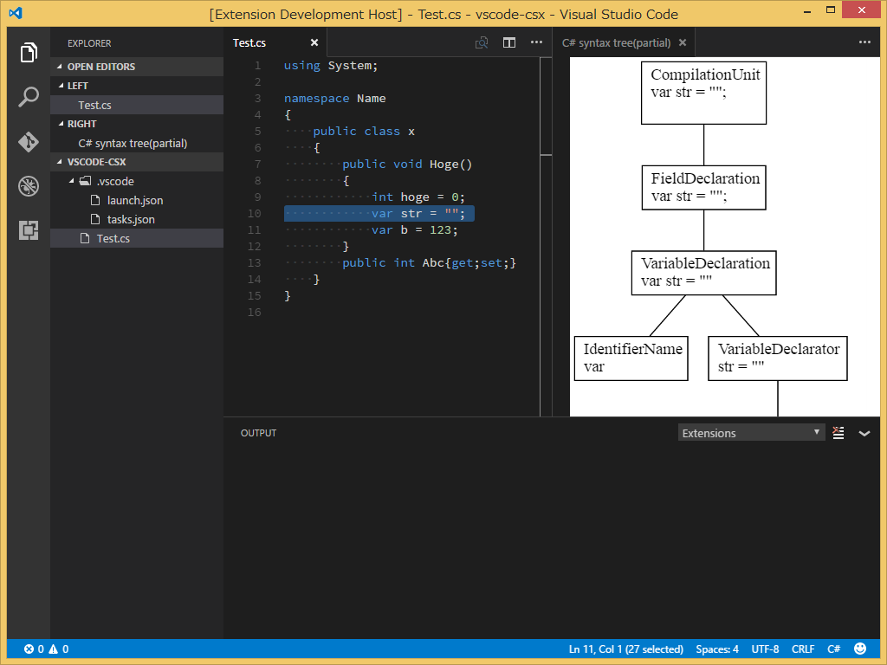

# cs-syntax-visualizer README

this is the visual studio code extension for C# syntax tree visualizer

## Features

C# syntax tree visualizer powered by roslyn

## Requirements

* [dotnet-cli version 1.0](https://www.microsoft.com/net/core)
* [graphviz(tested on 2.38)](http://www.graphviz.org/)

## Extension Settings

* `cssyntaxvisualizer.dotsPath`: fullpath to graphviz dot command 
    if empty or null,use GRAPHVIZ_DOT environment variable
* `cssyntaxvisualizer.dotnetPath`: fullpath to dotnet command
    if empty or null,use `dotnet`

## Known Issues

all issues(including feature enhancements) are listed in [github](https://github.com/itn3000/cs2dots/issues).

## Release Notes

Users appreciate release notes as you update your extension.

### 0.0.1

Initial release of c# syntax visualizer

## Acknowledgements

I used [plantuml previewer for visual studio code](https://marketplace.visualstudio.com/items?itemName=okazuki.okazukiplantuml) as a reference.
I really appreciate.